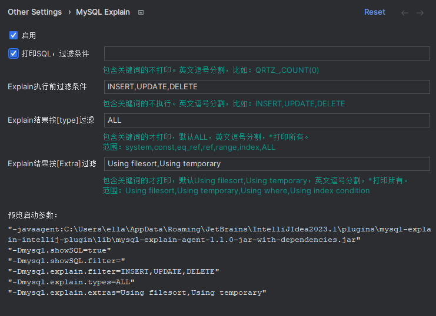
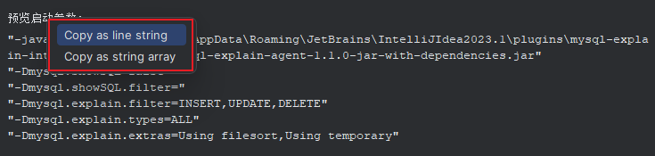

# MYSQL EXPLAIN

Auto execute mysql explain when execute sql in java project.

## Main functions

- Auto print original mysql sql log.
- Auto execute mysql explain when execute sql.
- Support jdk8+, mysql-connector 5,6,8.
- User-friendly, no intrusion into business services.

## 功能

- 自动打印 mysql 语句日志
- 自动查看 mysql 执行计划
- 支持 jdk8+，支持 mysql-connector 5、6、8
- 使用友好，对业务服务无侵入

## Agent 配置

1. 从文件读取：默认读取 classpath 下的 `mysql-explain.properties`。可通过`-Dmysql-explain-properties-file=xx.properties`指定配置文件。

2. 从 jvm 启动参数设置：格式 `-Dkey=value`，如果 value 包含空格，需用双引号包裹。

3. 支持的配置项如下：

```properties
# 是否打印所有执行的MySQL语句，默认false
mysql.showSQL=false

# 打印MySQL语句过滤条件：包含关键词的不打印。英文逗号分割，比如：QRTZ_,COUNT(0)
mysql.showSQL.filter=QRTZ_,COUNT(0)

# MySQL Explain执行前过滤条件，包含关键词的不执行。英文逗号分割，比如：INSERT,UPDATE,DELETE
mysql.explain.filter=INSERT,UPDATE,DELETE

# MySQL Explain结果按[type]过滤，包含关键词的才打印，默认ALL，英文逗号分割，*打印所有。范围：system,const,eq_ref,ref,range,index,ALL
mysql.explain.types=ALL

# MySQL Explain结果按[Extra]过滤，包含关键词的才打印，默认Using filesort,Using temporary，英文逗号分割，*打印所有。范围：Using filesort,Using temporary,Using where,Using index condition
mysql.explain.extras=Using filesort,Using temporary
```

## 使用

### 前提

项目为 Java 项目，且包含 mysql 连接驱动，支持 5、6、8

### Idea 中使用

从 Idea 仓库中安装 MySQL Explain 插件，在打开的项目中找到设置，勾选启用，设置条件，然后启动项目。



### VS Code 中使用

1. 从 vscode 插件市场安装 [java-mysql-explain](https://marketplace.visualstudio.com/items?itemName=newhoo.java-mysql-explain)，参考[使用说明](mysql-explain-vscode-plugin/README.md)
2. 打开 `launch.json` 文件，添加 Java 启动项后右键点击 `生成 Mysql Explain 启动参数` 生成所需的 Java 启动参数。如下

```json lines
{
  "version": "0.2.0",
  "configurations": [
    {
      "type": "java",
      "name": "Application",
      "request": "launch",
      // "console": "externalTerminal",
      "mainClass": "com.example.Application",
      "vmArgs": [
        // "-Ddebug",
        "-Xms1g",
        "-Xmx1g",
        "-javaagent:/home/admin/.vscode/extensions/newhoo.java-mysql-explain-1.0.0/jars/mysql-explain-agent.jar",
        "-Dmysql.showSQL=true",
        "-Dmysql.showSQL.filter=QRTZ_,COUNT(0)",
        "-Dmysql.explain.filter=INSERT,UPDATE,DELETE",
        "-Dmysql.explain.types=ALL",
        "-Dmysql.explain.extras=Using filesort,Using temporary"
      ]
    }
  ]
}
```

3. 启动项目，观察日志中自动执行 Explain 后的输出。

### 其他使用方式

1. 从 git 仓库中下载 agent `distributions/mysql-explain-agent-x.x.x-jar-with-dependencies.jar`，放到指定目录
2. 启动参数添加

```bash
"-javaagent:C:\\Users\\ella\\AppData\\Roaming\\JetBrains\\IntelliJIdea2023.1\\plugins\\mysql-explain-intellij-plugin\\lib\\mysql-explain-agent-1.1.0-jar-with-dependencies.jar"
"-Dmysql.showSQL=false"
"-Dmysql.showSQL.filter="
"-Dmysql.explain.filter=INSERT,UPDATE,DELETE"
"-Dmysql.explain.types=ALL"
"-Dmysql.explain.extras=Using filesort,Using temporary"
```

## 其他

1. 启动后输出，`-Ddebug`开启 debug 模式

```text
[mysql-explain] load parameter [mysql.showSQL] from jvm parameter: true
[mysql-explain] load parameter [mysql.explain.filter] from jvm parameter: INSERT,UPDATE,DELETE
[mysql-explain] load parameter [mysql.explain.types] from jvm parameter: ALL
[mysql-explain] load parameter [mysql.explain.extras] from jvm parameter: Using filesort,Using temporary
[mysql-explain] configurations:
+---+---------------------------+----------------------+--------------------------------+--------------------------------+------------------------------------------------------------------+
| # | config item               | config key           | current value                  | default value                  | remark                                                           |
+---+---------------------------+----------------------+--------------------------------+--------------------------------+------------------------------------------------------------------+
| 1 | Print SQL                 | mysql.showSQL        | true                           | false                          | true/false                                                       |
| 2 | Filter out before print   | mysql.showSQL.filter |                                |                                | Example: QRTZ_,COUNT(0)                                          |
| 3 | Filter out before explain | mysql.explain.filter | INSERT,UPDATE,DELETE           |                                | Example: INSERT,UPDATE,DELETE                                    |
| 4 | Filter by explain [type]  | mysql.explain.types  | ALL                            | ALL                            | system,const,eq_ref,ref,range,index,ALL                          |
| 5 | Filter by explain [Extra] | mysql.explain.extras | Using filesort,Using temporary | Using filesort,Using temporary | Using filesort,Using temporary,Using where,Using index condition |
+---+---------------------------+----------------------+--------------------------------+--------------------------------+------------------------------------------------------------------+
```

2. 如果同时有使用 idea，可在 idea 配置中生成启动参数


