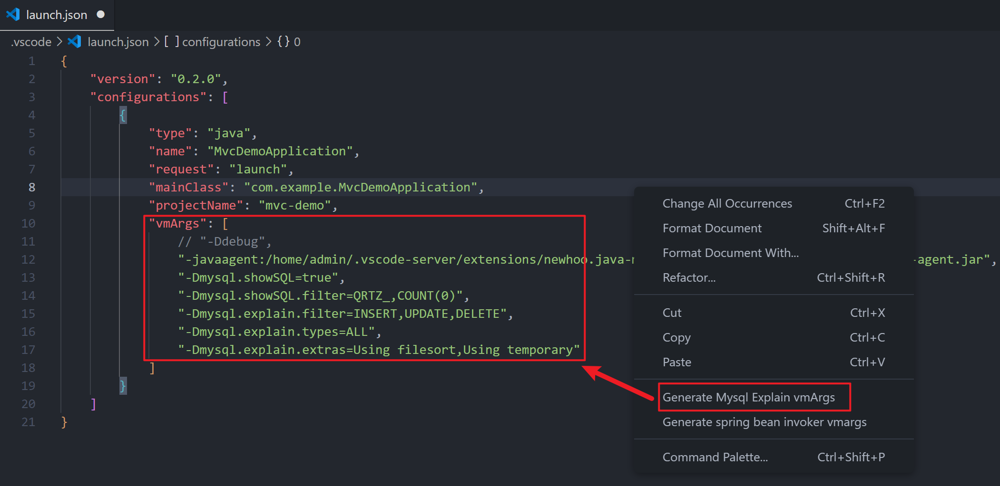
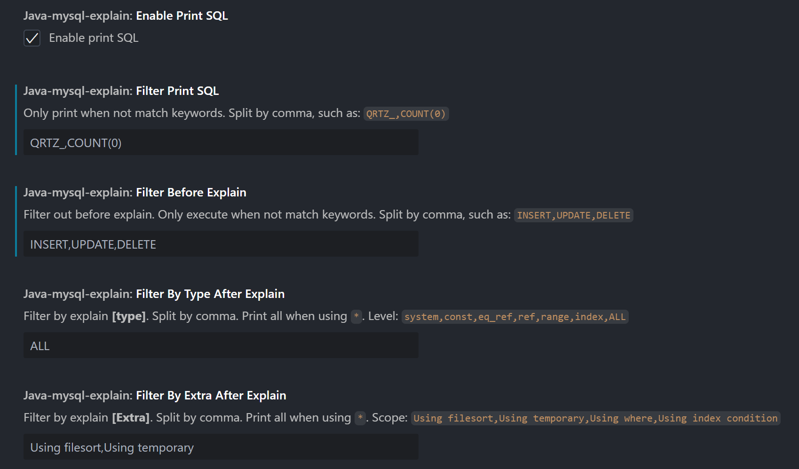

# java-mysql-explain

Auto execute mysql explain when execute sql in java project. Install via the [VSCode Marketplace](https://marketplace.visualstudio.com/items?itemName=newhoo.java-mysql-explain) or see [Installation Instructions](https://code.visualstudio.com/api/working-with-extensions/publishing-extension#packaging-extensions).

## Features

- Auto print original mysql sql log.
- Auto execute mysql explain when execute sql.
- Support jdk8+, mysql-connector 5,6,8.
- User-friendly, no intrusion into business services.

<br/>

- 自动打印 mysql 语句日志
- 自动查看 mysql 执行计划
- 支持 jdk8+，支持 mysql-connector 5、6、8
- 使用友好，对业务服务无侵入

## Usage

Open the **launch.json** file, add a java startup item if not exists, then right-click the item `Generate Mysql Explain vmArgs` to generate neccessary vmargs for current java project. After this, you can startup your app that works with executing mysql explain automatically.

_打开 launch.json 文件，添加 Java 启动项后右键点击 `生成 Mysql Explain 启动参数` 生成所需的 Java 启动参数。然后启动项目，观察日志中自动执行 Explain 后的输出。_



App startup log with `-Ddebug`:

```
[mysql-explain] load parameter [mysql.showSQL] from jvm parameter: true
[mysql-explain] load parameter [mysql.explain.filter] from jvm parameter: INSERT,UPDATE,DELETE
[mysql-explain] load parameter [mysql.explain.types] from jvm parameter: ALL
[mysql-explain] load parameter [mysql.explain.extras] from jvm parameter: Using filesort,Using temporary
[mysql-explain] configurations:
+---+---------------------------+----------------------+--------------------------------+--------------------------------+------------------------------------------------------------------+
| # | config item               | config key           | current value                  | default value                  | remark                                                           |
+---+---------------------------+----------------------+--------------------------------+--------------------------------+------------------------------------------------------------------+
| 1 | Print SQL                 | mysql.showSQL        | true                           | false                          | true/false                                                       |
| 2 | Filter out before print   | mysql.showSQL.filter |                                |                                | Example: QRTZ_,COUNT(0)                                          |
| 3 | Filter out before explain | mysql.explain.filter | INSERT,UPDATE,DELETE           |                                | Example: INSERT,UPDATE,DELETE                                    |
| 4 | Filter by explain [type]  | mysql.explain.types  | ALL                            | ALL                            | system,const,eq_ref,ref,range,index,ALL                          |
| 5 | Filter by explain [Extra] | mysql.explain.extras | Using filesort,Using temporary | Using filesort,Using temporary | Using filesort,Using temporary,Using where,Using index condition |
+---+---------------------------+----------------------+--------------------------------+--------------------------------+------------------------------------------------------------------+
```

## Extension Settings



## Requirements

VSCode 1.85.0 or newer

## Development

Compile before debugging. Debug (F5) while editing `extension.ts` to spawn a VSCode debug instance.
